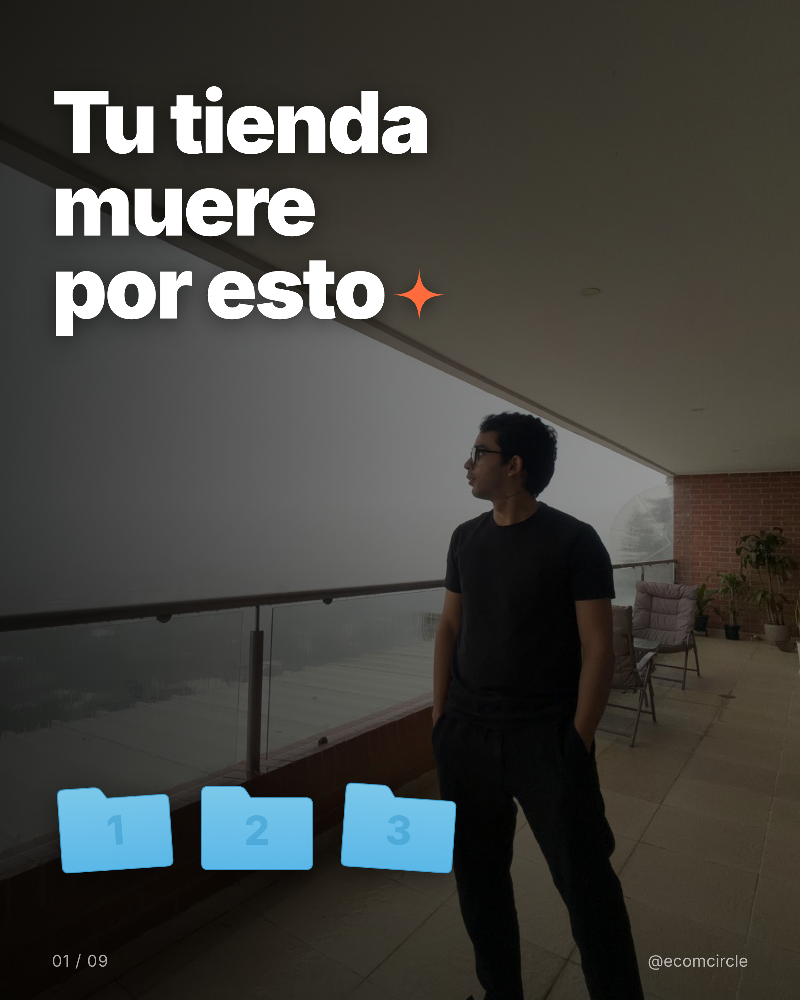
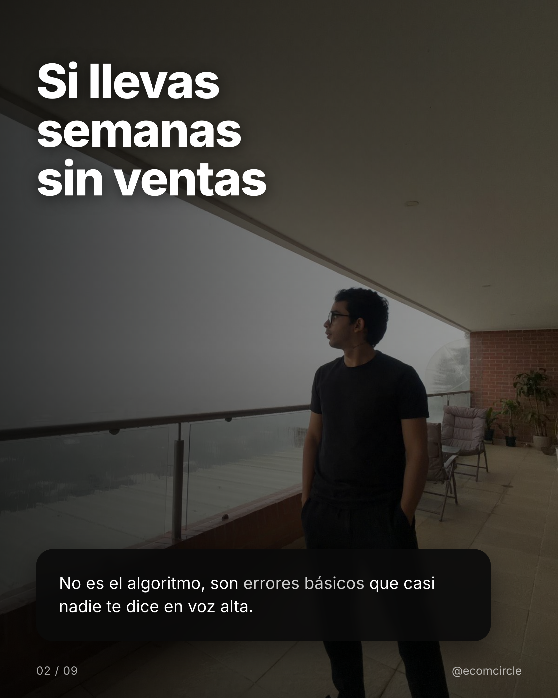
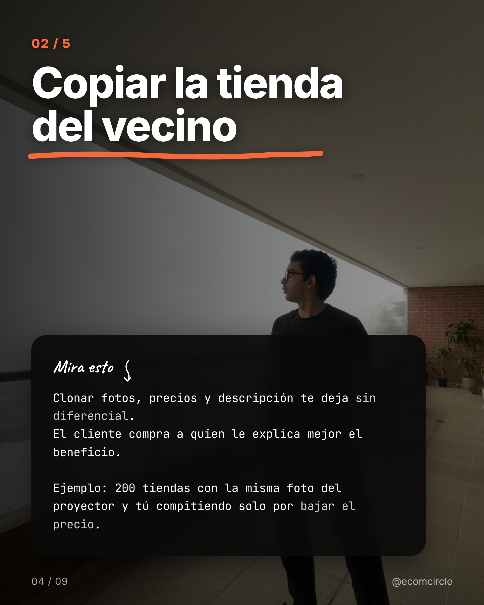
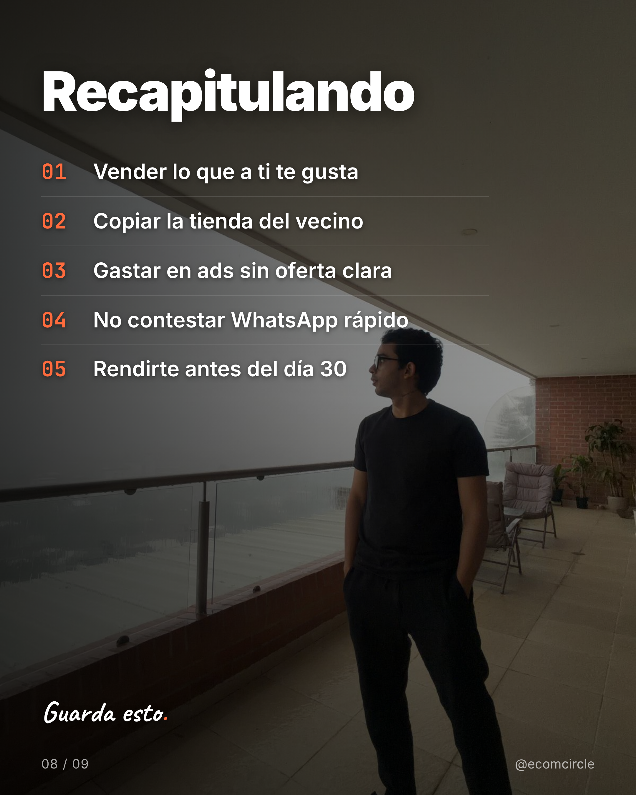
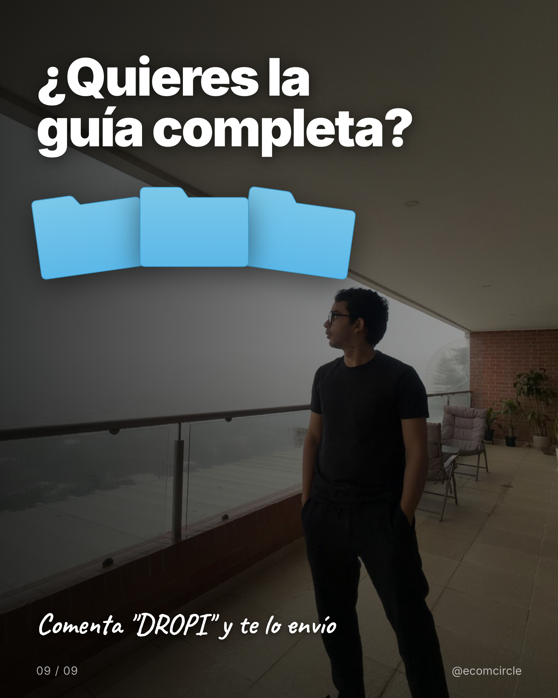

# carousel-generator

> **Skill de Claude Code para generar carruseles virales de Instagram.** Pides un tema, un CTA, y en menos de 1 minuto tienes 9 PNGs listos para publicar — con copy probado, diseño tipo creador top, y foto generada por IA acorde al tema.

Diseñado **100% para usarse con [Claude Code](https://claude.com/code)**. Una sola línea: `/carrusel`. Claude se encarga de todo el flujo conversacional: te pregunta tema, CTA, estilo, y dispara el pipeline.

---

## Qué hace

Un skill que combina:

- **Apify** — scrapea el feed o un post de cualquier creador como referencia visual
- **Claude Code (vision)** — analiza el estilo (paleta, tipografía, layout, vibra) y lo guarda como preset reutilizable
- **Claude Code (texto)** — genera 9 slides con la estructura probada **Hook → Dolor → Valor (×5) → Recap → CTA**
- **Nano Banana** (Gemini 2.5 Flash Image) — genera una foto contextual al tema (opcional)
- **HTML + CSS + Playwright** — renderiza slides 1080×1350 PNG listos para Instagram

**Costo total por carrusel: $0 a $0.07.** El copy y análisis lo hace Claude Code via tu plan Max, sin cobrar API. Solo pagas Apify ($0.025 una sola vez por preset) y opcionalmente Nano Banana ($0.04 por foto generada).

---

## Demo

| Hook | Dolor | Valor |
|---|---|---|
|  |  |  |

| Recap | CTA |
|---|---|
|  |  |

Carrusel completo en [`examples/dropshipping/`](examples/dropshipping). Tema: "Errores que matan tu primera tienda de dropshipping". Generado en 60 segundos con `/carrusel`.

---

## Quick start (3 minutos)

### 1. Instala Claude Code

Si aún no lo tienes:

```bash
npm install -g @anthropic-ai/claude-code
```

Necesitas el plan **Max** (recomendado) o un plan que incluya uso de Claude Code. Sin él, este skill no funciona — la IA del copy se hace via subprocess al binario `claude`, no via API directa.

### 2. Clona el repo

```bash
git clone https://github.com/ecomcirclesocial-ecom/carousel-generator.git
cd carousel-generator
```

### 3. Instala el skill en Claude Code

```bash
mkdir -p ~/.claude/skills/carrusel
cp skill/SKILL.md ~/.claude/skills/carrusel/SKILL.md
```

### 4. Setup del CLI

```bash
# Crea venv (con uv recomendado)
uv venv
source .venv/bin/activate
uv pip install -r requirements.txt
playwright install chromium

# Configura tus tokens
cp .env.example .env
# Edita .env y pega tus keys (ver siguiente sección)
```

### 5. Configura tus API keys

Edita `.env`:

```bash
APIFY_TOKEN=apify_api_xxxxxxxxxxxxxxx       # https://console.apify.com/ (free tier $5/mes)
GEMINI_API_KEY=AIzaSyXXXXXXXXXXXXXXXX         # https://aistudio.google.com/apikey (free $300 crédito)
```

> **No necesitas `ANTHROPIC_API_KEY`.** El skill usa el binario `claude` (tu plan Max) via subprocess.

### 6. Úsalo

Abre Claude Code en el directorio del repo y escribe:

```
/carrusel
```

Claude te va a preguntar tema, CTA, foto, idioma — y genera el carrusel completo.

---

## Cómo se siente usarlo

```
> /carrusel

→ Validando setup... ✓ env, ✓ claude CLI, ✓ 1 preset disponible

¿Cuál es el tema del carrusel?
> Cómo escalar una agencia de marketing

¿Palabra del CTA? (qué quieres que comenten)
> AGENCIA

¿Foto de fondo?
1. Generar con Nano Banana (acorde al tema)
2. Foto propia (path)
3. Sin foto

> 1

¿Idioma?
> es

→ Generando foto con Nano Banana...
  ✓ assets/generated/como-escalar-una-agencia-de-marketing.png
→ Generando copy con claude...
✓ 9 slides generados en output/como-escalar-una-agencia-de-marketing/

  · slide-01.png  (hook)
  · slide-02.png  (dolor)
  · slide-03.png  (valor 1)
  ... 
  · slide-08.png  (recap)
  · slide-09.png  (cta)

→ Abriendo preview en navegador...
```

Total: ~60 segundos. Cero código tocado por ti.

---

## La estructura de copy

Los 9 slides siguen una fórmula probada que funciona en cualquier nicho:

| # | Rol | Qué cumple |
|---|---|---|
| 1 | **Hook** | Máximo 6 palabras. Idea que rompe patrón. |
| 2 | **Dolor** | "Si llevas X meses sin..." Reconoce el dolor del lector. |
| 3-7 | **Valor** | 5 puntos. Cada uno: título + 2 líneas + 1 ejemplo concreto. |
| 8 | **Recap** | Lista numerada de los 5 puntos. "Guarda esto." |
| 9 | **CTA** | UNA sola acción. "Comenta X y te lo envío." |

Claude marca palabras clave con `**doble asterisco**` y se renderizan en color de acento en cada slide.

**Aplicable a cualquier nicho**: dropshipping, fitness, finanzas personales, productividad, agencias, real estate, AI tools, lo que sea.

---

## Estilo visual

El template `diferencia_foto.html` replica los elementos típicos de carruseles virales:

- Subrayado naranja "hand-drawn" (SVG inline)
- Tarjeta tipo terminal con texto mono y palabras coloreadas
- Carpetas azules estilo macOS (SVG)
- Sparkle/asterisco naranja
- Etiquetas en cursiva tipo nota a mano (Caveat)
- Foto opcional como fondo con overlay degradado

Para añadir tu propio template visual: ver [CONTRIBUTING.md](CONTRIBUTING.md).

---

## Comandos del CLI (bajo el capó)

Si prefieres usar el CLI directamente sin pasar por el skill `/carrusel`:

```bash
# Crear preset desde un post de referencia
python cli.py preset create --post https://www.instagram.com/p/<shortcode>/ --name <slug>

# O desde el feed de un creador (top 10 carruseles)
python cli.py preset create --creator <handle> --name <slug>

# Listar presets
python cli.py preset list

# Generar carrusel
python cli.py generate \
  --preset <slug> \
  --tema "Tu tema" \
  --cta "PALABRA" \
  --generate-photo \
  --idioma es \
  --handle "@tu_handle"

# Preview en navegador
python cli.py preview --dir output/<tema-slug>
```

Pero la forma natural es **usar el skill** — Claude orquesta todo.

---

## Costos

| Servicio | Costo | Cuándo aplica |
|---|---|---|
| Claude Code (copy + análisis de estilo) | $0 | Siempre — usa tu plan Max via subprocess |
| Apify (scraping de post/creador) | ~$0.025 | Una sola vez por preset (free tier $5/mes alcanza para ~200) |
| Nano Banana (foto del tema) | ~$0.04 | Solo si usas `--generate-photo` ($300 crédito al crear cuenta de Google AI Studio) |
| **Total carrusel típico** | **~$0.07** | Con foto generada por IA |
| **Total sin foto IA** | **~$0** | Si pasas tu propia foto o sin foto |

---

## Estructura del repo

```
carousel-generator/
├── cli.py                  # entry point del CLI Python
├── scraper.py              # Apify wrapper + descarga de imágenes
├── claude_cli.py           # subprocess al binario `claude`
├── style_extractor.py      # Claude vision → preset JSON
├── prompts.py              # prompts de Claude (estilo + copy)
├── generator.py            # orquesta copy + render
├── renderer.py             # Playwright HTML → PNG
├── nano_banana.py          # Gemini 2.5 Flash Image (foto del tema)
├── config.py               # paths + env loading
├── templates/
│   ├── diferencia.html     # template base sin foto
│   └── diferencia_foto.html # template con foto + overlay
├── presets/                # presets JSON (usuarios crean los suyos)
├── examples/               # carruseles de muestra
├── skill/
│   └── SKILL.md            # skill para Claude Code
├── .env.example            # template de variables
├── requirements.txt
├── README.md
├── CONTRIBUTING.md
└── LICENSE                 # MIT
```

---

## Roadmap

- [x] CLI funcional con 9 slides estructura Hook→Dolor→Valor→Recap→CTA
- [x] Skill de Claude Code `/carrusel`
- [x] Generación de foto contextual con Nano Banana
- [x] Preview en navegador con galería
- [ ] Multi-foto: 1 foto distinta por slide (cuando el usuario sube varias)
- [ ] Pinterest scraper como fuente de referencia visual
- [ ] Templates como plugins (carga automática desde `templates/`)
- [ ] Variantes A/B del hook (3 versiones para A/B test)
- [ ] Re-render parcial: `--regenerate-slide N`
- [ ] Posicionamiento dinámico que evita el sujeto en la foto
- [ ] Voz personal: cargar posts previos del usuario para clonar su tono

¿Quieres aportar? Ver [CONTRIBUTING.md](CONTRIBUTING.md).

---

## Limitaciones conocidas

- **Carpetas tapan elementos**: en slides con foto, los iconos de carpetas pueden tapar parte del sujeto. Solución futura: detección de bbox del sujeto.
- **Headline largo en slide pain**: a veces Claude pone párrafos enteros en el headline. Workaround: editar manualmente `copy.json` y re-renderizar.
- **Solo 1 template visual por ahora**: `diferencia_foto.html`. Más templates en roadmap.

---

## Por qué no usa la API de Anthropic

Por diseño. La idea es que **el costo de IA sea $0 si ya tienes Claude Code**. El módulo `claude_cli.py` invoca `claude -p "<prompt>" --output-format json` como subprocess y parsea la respuesta. Así usas tu plan Max sin cobros adicionales por tokens.

Trade-off: latencia un poco más alta (~5-10s por llamada vs ~2s de la API). Para 1 análisis de estilo + 1 generación de copy por carrusel, es totalmente aceptable.

---

## Licencia

MIT — ver [LICENSE](LICENSE).

## Créditos

Construido por [Nain Guevara](https://www.instagram.com/nain_guevara/) (fundador de [Ecom Circle](https://ecomcircle.co)) con Claude Code.

Estructura de copy inspirada en carruseles virales latam. Templates visuales inspirados en el creador "diferencia" — el preset inicial replica su estética.

---

**¿Lo probaste? Etiquétame en Instagram con tu carrusel: [@nain_guevara](https://www.instagram.com/nain_guevara/)**
